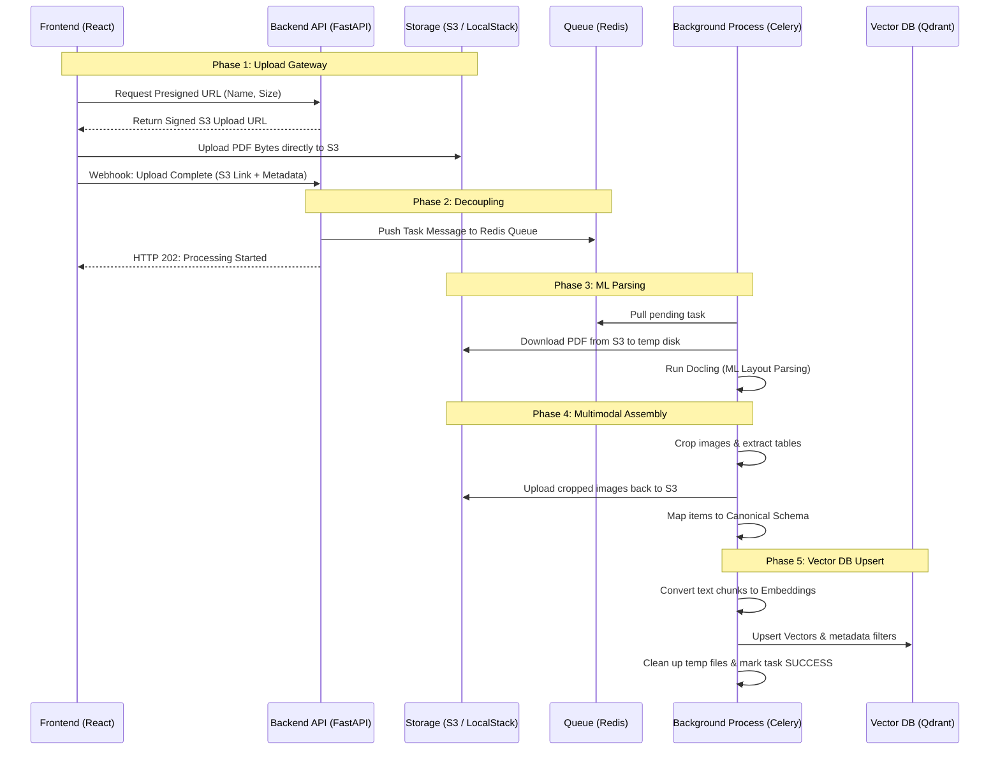

# KnowledgeOS: Backend Engineering Guide (For Beginners)

Welcome to the backend team of **KnowledgeOS** (KgpOne)! This guide is designed to help you understand how our server and processing pipelines function, especially if you are new to the codebase. 

---

## 🛠️ The Technology Stack

To build a high-performance, AI-driven learning system, we use these main technologies:
1. **Web Frame**: **FastAPI** (Python 3.11+) — Super fast web framework for building our APIs.
2. **Task Queue**: **Celery** + **Redis** — Redis stores task messages, and Celery workers process them in the background.
3. **Primary Databases**:
   - **PostgreSQL** — Relational database for users, roles, and transaction data.
   - **Qdrant** — Vector database for storing and querying AI document embeddings (semantic search).
   - **Neo4j** — Graph database for mapping course prerequisites and learning paths.
4. **Asset Storage**: **Amazon S3** (using **LocalStack** locally) — Stores uploaded PDF textbooks and cropped diagram images.
5. **AI Extraction**: **Docling** — An ML tool that parses complex PDF layouts into structured data.

---

## 📁 Backend File Structure (`/backend`)

Here is where backend code lives and what each folder does:

```text
backend/
│
├── main.py                     # Entry point for backend setup script
├── pyproject.toml              # Dependencies list (Celery, FastAPI, Redis, etc.)
│
└── src/
    ├── app.py                  # Initialise FastAPI application, middleware, & routes
    │
    ├── config/                 # Service configurations
    │   ├── database.py         # SQLAlchemy (PostgreSQL/SQLite) connection
    │   ├── celery_config.py    # Celery worker settings
    │   └── s3.py / qdrant.py   # Client initializations for S3 & Vector DB
    │
    ├── routes/                 # API endpoint definitions
    │   ├── auth_routes.py      # Login, token refresh, and registration
    │   ├── workspace_routes.py # Ingestion & workspace retrieval
    │   └── task_routes.py      # Celery task status monitoring endpoints
    │
    ├── tasks/                  # Celery worker configuration & task files
    │   ├── celery_app.py       # Celery application initialization
    │   └── sample_tasks.py     # Task code (e.g. document parsing, addition)
    │
    ├── services/               # Core business logic
    │   ├── auth/               # JWT auth & security helpers
    │   ├── ingestion/          # PDF layout analysis & parsing (Docling)
    │   └── rag/                # Retrieval Augmented Generation logic
    │
    └── models/ / schemas/      # DB schemas & Pydantic request/response models
```

---

## 🔄 The 5-Phase Document Processing Pipeline

When a user uploads a PDF, it goes through 5 distinct architectural boundaries:



### Phase 1: The Presigned Upload Gateway
* **Goal**: Keep heavy files out of FastAPI server memory.
* **Mechanism**:
  1. Frontend asks FastAPI for permission to upload.
  2. FastAPI uses `boto3` to generate a temporary **Presigned S3 URL** (valid for 15 mins) and sends it back.
  3. Frontend uploads the file *directly* to S3, bypassing our Python API.
  4. Once uploaded, the frontend hits our webhook with the file's S3 key and course metadata.

### Phase 2: Asynchronous Decoupling (FastAPI to Redis)
* **Goal**: Free up the web request immediately so the user doesn't wait.
* **Mechanism**:
  1. FastAPI receives the webhook and packages details (S3 URL, course ID, file ID) into a **Task Message**.
  2. FastAPI pushes this message to **Redis** (our queue broker).
  3. FastAPI immediately responds to the frontend: `"status": "processing"`. The HTTP request is closed.

### Phase 3: The Intelligence Worker (Celery to Docling)
* **Goal**: Handle heavy Machine Learning workloads outside the web server.
* **Mechanism**:
  1. A background **Celery worker** pulls the task message from Redis.
  2. The worker downloads the PDF from S3 to a local temp folder.
  3. The worker runs **Docling**, parsing layout, headers, paragraphs, and tables.

### Phase 4: Multimodal Assembly & Hierarchy Mapping
* **Goal**: Extract diagrams, run vision analysis, and catalog hierarchy.
* **Mechanism**:
  1. If Docling spots an image, the worker crops it out of the PDF, uploads the cropped PNG to S3, and sends it to Gemini for a description.
  2. The text is split into chunks. Each chunk is stamped with its location (e.g., Chapter 2, Section 3).

### Phase 5: Vectorization and Database Upsert (Worker to Qdrant)
* **Goal**: Index chunks to enable fast, contextual, semantic query searches.
* **Mechanism**:
  1. The worker requests vector embeddings for the chunks from an embedding service.
  2. The worker upserts these vectors and metadata (course, folder, S3 links) into **Qdrant**.
  3. The task is marked as `SUCCESS` in Redis, and local temporary files are deleted.

---

## 🚀 How to Run the Backend Locally

Follow these quick commands to spin up the local environment:

1. **Start infrastructure databases (Docker)**:
   Ensure Docker is running, then start databases:
   ```bash
   docker compose up -d
   ```
   *(This boots up PostgreSQL, Neo4j, Qdrant, LocalStack S3, and Redis.)*

2. **Install Python dependencies**:
   Make sure you are in the `backend/` directory:
   ```bash
   uv sync
   ```

3. **Start the Celery worker**:
   Start the worker in a separate terminal:
   ```bash
   uv run celery -A src.tasks.celery_app worker --loglevel=info
   ```

4. **Start the FastAPI Dev Server**:
   Start the web application server:
   ```bash
   uv run uvicorn src.app:app --reload
   ```
   *(Your API is now live at `http://localhost:8000`.)*
